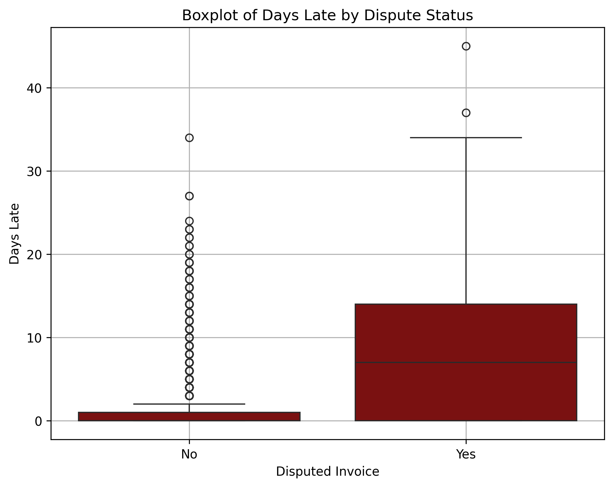

# ACCOUNT RECEIVABLES ANALYSIS


> Source: https://bizzi.vn/wp-content/uploads/2025/04/accounts-receivable-la-gi.jpeg

This project utilizes a historical invoice and payment transactions dataset from a finance factoring context to explore billing methods, disputes, settlement timing, and payment delays through data analysis and visualization.

Finance factoring (also known as accounts receivable financing) is a financial service where a business sells its outstanding invoices to a third-party company (the "factor") at a discount in exchange for immediate cash. The factor then collects payment directly from the customers, assuming the credit risk and providing faster liquidity to the seller without creating debt.

The dataset contains information from 2,466 invoices, with invoices issued from January 2012 to December 2013 and payments settled from January 2012 to January 2014. Each record represents a unique invoice, identified by the `invoiceNumber`

## Data source
This data was provided by IBM for testing out their analytics tools. It can be assessed via Kaggle
Dataset source: [Kaggle - Finance Factoring IBM Late Payment Histories](https://www.kaggle.com/datasets/hhenry/finance-factoring-ibm-late-payment-histories)

***How to get the data?***
```sql
import kagglehub
path = kagglehub.dataset_download("hhenry/finance-factoring-ibm-late-payment-histories")
df = pd.read_csv("/kaggle/input/finance-factoring-ibm-late-payment-histories/WA_Fn-UseC_-Accounts-Receivable.csv")
```

## Dataset Overview

The dataset contains historical invoice and payment transactions from a finance factoring context, including details on billing methods, disputes, settlement timing, and payment delays.

- **Data Period**:
  - Invoices issued from January 2012 to December 2013.
  - Payments settled from January 2012 to January 2014.

- **Number of Records**: 2,466 records

- **Record Level**: Each record represents one invoice, unique by `invoiceNumber`.

## Data Structure
Below is a detailed description of the columns in the datasets:

| Column Name      | Description                                                                                          |
|------------------|------------------------------------------------------------------------------------------------------|
| countryCode      | Numeric code representing the customer’s country or region.                                          |
| customerID       | Unique identifier for each customer.                                                                 |
| PaperlessDate    | Date when the customer switched to paperless billing (if applicable).                                |
| invoiceNumber    | Unique identifier for each invoice (primary key of the dataset).                                     |
| InvoiceDate      | Date when the invoice was issued.                                                                    |
| DueDate          | Contractual payment due date for the invoice.                                                        |
| InvoiceAmount    | Total monetary value of the invoice.                                                                 |
| Disputed         | Indicator whether the invoice was disputed (`Yes` or `No`).                                          |
| SettledDate      | Actual date when the payment was settled.                                                            |
| PaperlessBill    | Billing method used for the invoice (`Paper` or `Electronic`).                                       |
| DaysToSettle     | Number of days taken from invoice issuance to payment settlement.                                    |
| DaysLate         | Number of days the payment was late compared to the due date (0 if paid on time or early).           |

## Data Cleaning
Let's perform initial data inspection to understand structure, data types, and missing values.

```sql
df.sample(3)
```

|   countryCode | customerID   | PaperlessDate   |   invoiceNumber | InvoiceDate   | DueDate    |   InvoiceAmount | Disputed   | SettledDate   | PaperlessBill   |   DaysToSettle |   DaysLate |
|--------------:|:-------------|:----------------|----------------:|:--------------|:-----------|----------------:|:-----------|:--------------|:----------------|---------------:|-----------:|
|      818 | 7946-HJDUR   | 2/21/2012       |      9373791288 | 3/31/2012     | 4/30/2012  |           60.57 | No         | 4/21/2012     | Electronic      |             21 |          0 |
|     770 | 9323-NDIOV   | 7/9/2012        |      8996690503 | 9/18/2012     | 10/18/2012 |           61.32 | Yes        | 10/25/2012    | Electronic      |             37 |          7 |
|    406 | 6833-ETVHD   | 4/30/2012       |      8844419761 | 5/10/2013     | 6/9/2013   |           54.69 | No         | 6/1/2013      | Electronic      |             22 |          0 |


```sql
df.info()
```

### Data Summary

```
<class 'pandas.core.frame.DataFrame'>
RangeIndex: 2466 entries, 0 to 2465
Data columns (total 12 columns):
 #   Column         Non-Null Count  Dtype         
---  --------------  --------------  -------------- 
  0   countryCode    2466 non-null   int64  
 1   customerID     2466 non-null   object 
 2   PaperlessDate  2466 non-null   object 
 3   invoiceNumber  2466 non-null   int64  
 4   InvoiceDate    2466 non-null   object 
 5   DueDate        2466 non-null   object 
 6   InvoiceAmount  2466 non-null   float64
 7   Disputed       2466 non-null   object 
 8   SettledDate    2466 non-null   object 
 9   PaperlessBill  2466 non-null   object 
 10  DaysToSettle   2466 non-null   int64  
 11  DaysLate       2466 non-null   int64  
dtypes: float64(1), int64(4), object(7)
```
Upon reviewing df.info(), the dataset has 2,466 records across 12 columns with no missing values. However, a few data types should be adjusted for better analysis:

* Convert date columns (`PaperlessDate`, `InvoiceDate`, `DueDate`, `SettledDate`) from object to datetime.
* Change `invoiceNumber`, `countryCode` from int64 to object (string), as it is an identifier.

```sql
date_cols = ['PaperlessDate','InvoiceDate', 'DueDate', 'SettledDate']

for col in date_cols:
    df[col] = pd.to_datetime(df[col])

df['invoiceNumber'] = df['invoiceNumber'].astype(str)
df['countryCode'] = df['countryCode'].astype(str)
```

- Converted `Disputed` and `PaperlessBill` to appropriate formats for analysis.
- Verified no missing values and no invalid dates (e.g., settlement before invoice).
- No duplicates found.

## Exploratory Data Analysis (EDA)
- Generated summary statistics for numerical variables (`InvoiceAmount`, `DaysToSettle`, `DaysLate`).

```sql
numeric_cols = df.select_dtypes(include=['number'])
```
```sql
numeric_summary = numeric_cols.describe().round(2)
print(numeric_summary)
```

```
      InvoiceAmount  DaysToSettle  DaysLate
count        2466.00       2466.00   2466.00
mean           59.90         26.44      3.44
std            20.44         12.33      6.29
min             5.26          0.00      0.00
25%            46.40         18.00      0.00
50%            60.56         26.00      0.00
75%            73.76         35.00      5.00
max           128.28         75.00     45.00
```

- Visualized:
  - Distribution of payment delays (histogram)
  - Correlation heatmap of key behavioral factors
  - Aging bucket distribution
  - Average delay by country and by invoice month
  - Monthly invoiced amount time-series (seasonal pattern)
- Customer-level aggregation: late payment ratio, average delay, transaction frequency.

## Analysis Performed
* **Correlation analysis**: 

```sql
  heatmap_cols = [
    'DaysLate',
    'TransactionFrequency',
    'InvoiceAmount',
    'Disputed',
    'PaperlessBill']
  ```
```sql
heatmap_data = df[heatmap_cols].copy()
heatmap_data['Disputed'] = heatmap_data['Disputed'].map({'Yes': 1, 'No': 0})
heatmap_data['PaperlessBill'] = heatmap_data['PaperlessBill'].map({'Paper': 0, 'Electronic': 1})
```
```sql
plt.figure(figsize=(8,6))
sns.heatmap(
    heatmap_data.corr(),
    annot=True,
    cmap='YlOrBr',
    fmt='.2f'
)
plt.title('Correlation Heatmap of Customer Behavior and Payment Risk')
plt.show()
```


> Strongest positive correlation between disputes and delays (0.44); moderate negative correlation with electronic billing (−0.16).
 
- **Group comparisons**: Disputed invoices average ~8.5 days late vs. ~2 days for non-disputed; electronic bills paid ~2 days earlier.

     | Disputed   |   DaysLate |
     |-----------|-----------|
     | No         |       1.93 |
     | Yes        |       8.58 |

Let's see how different between disputed and non disputed invoices:

  

**Non-disputed invoices** are mostly paid on time, with the median ***close to zero*** and an extremely small IQR, indicating that payment behavior in this group is highly consistent.

In contrast, **disputed invoices** exhibit much ***longer delays*** and substantially higher variability. The median delay is around 7–8 days, and the IQR is wide, showing that the middle 50% of disputed invoices fall roughly between 0 and 15 days late.

Regarding **outliers**, both groups contain extreme cases: 
* Disputed invoices show very large outliers, with delays reaching approximately 45 days, reflecting prolonged dispute resolution in certain cases. 

* Although non-disputed invoices typically have near-zero delays, they also present several outliers (up to around 35 days), indicating that late payments can still occur even without formal disputes, though these cases are relatively rare.

Overall, the wider IQR and more extreme outliers in the disputed group reinforce the conclusion that disputes not only increase average payment delay but also introduce greater uncertainty into the payment cycle.

    | PaperlessBill   |   DaysLate |
    |-----------------|------------|
    | Electronic      |       2.39 |
    | Paper           |       4.44 |
  
- **Seasonality**: Clear annual cycle with peak invoicing in March–April and sharp decline toward year-end.


> The time-series analysis reveals a strong **annual seasonal pattern** in monthly invoiced amounts. In both 2012 and 2013, invoicing peaks sharply in **March–April**, followed by a steady decline throughout the year, reaching near-zero levels by year-end.

> Notably, 2013 exhibits lower peaks and a steeper decline compared to 2012, suggesting a reduction in overall business volume or customer activity.

> **Recommendation**: To manage cash flow effectively, the company should build reserves during low periods, intensify collection efforts in peak months, and consider seasonal adjustments to credit terms or sales incentives.

- **Region**:


>* **Country 818** has the highest payment delays
Average 4.82 days late -> potential collection challenges in this region.
-> Implement earlier reminders, automated follow-up emails, or assign dedicated collectors to monitor invoices from this area more closely.

>* **Country 391** performs the best
Lowest average delay at only 1.85 days -> customers from this country pay fastest and most reliably.
-> Offer extended credit limits or reduced deposit requirements to encourage higher sales volume.

- **Customer segmentation**: Created risk groups (High/Medium/Low) based on late payment ratio and average delay.

```sql
TotalInvoices = df['customerID'].value_counts()
LateInvoices = df[df['DaysLate'] > 0]['customerID'].value_counts()
customer_df['LateRatio'] = customer_df['LateInvoices'] / customer_df['TotalInvoices']
```
```sql
avg_days_late = df.groupby('customerID')['DaysLate'].mean()
customer_df['AvgDaysLate'] = avg_days_late
```
```sql
customer_df['RiskGroup'] = np.where(
    (customer_df['LateRatio'] > 0.5) | (customer_df['AvgDaysLate'] > 10),
    'High Risk',
    np.where(
        customer_df['LateRatio'] > 0.2,
        'Medium Risk',
        'Low Risk'))
```
```sql
customer_df['RiskGroup'].value_counts()
```
 | RiskGroup   |   count |
 |-------------|---------|
 | Low Risk    |      45 |
 | High Risk   |      34 |
 | Medium Risk |      21 |
 

- **Statistical modeling**: Multiple linear regression (OLS) predicting `DaysLate`:

```sql
X = df_model[
    ['InvoiceAmount', 'Disputed', 'PaperlessBill', 'TransactionFrequency']]
y = df_model['DaysLate']

X = X.apply(pd.to_numeric, errors='coerce')
y = pd.to_numeric(y, errors='coerce')

df_ols = pd.concat([X, y], axis=1).dropna()

X = df_ols[X.columns]
y = df_ols['DaysLate']

X = sm.add_constant(X)

model = sm.OLS(y, X).fit()
print(model.summary())
```
```
                            OLS Regression Results                            
==============================================================================
Dep. Variable:               DaysLate   R-squared:                       0.225
Model:                            OLS   Adj. R-squared:                  0.223
Method:                 Least Squares   F-statistic:                     178.3
Date:                Thu, 25 Dec 2025   Prob (F-statistic):          2.93e-134
Time:                        13:30:06   Log-Likelihood:                -7720.0
No. Observations:                2466   AIC:                         1.545e+04
Df Residuals:                    2461   BIC:                         1.548e+04
Df Model:                           4                                         
Covariance Type:            nonrobust                                         
========================================================================================
                           coef    std err          t      P>|t|      [0.025      0.975]
----------------------------------------------------------------------------------------
const                    3.9573      0.695      5.691      0.000       2.594       5.321
InvoiceAmount           -0.0008      0.006     -0.138      0.891      -0.012       0.010
Disputed                 6.6684      0.269     24.762      0.000       6.140       7.196
PaperlessBill           -2.0422      0.225     -9.094      0.000      -2.483      -1.602
TransactionFrequency    -0.0387      0.023     -1.656      0.098      -0.085       0.007
==============================================================================
Omnibus:                      815.737   Durbin-Watson:                   2.061
Prob(Omnibus):                  0.000   Jarque-Bera (JB):             2767.849
Skew:                           1.649   Prob(JB):                         0.00
Kurtosis:                       7.008   Cond. No.                         423.
==============================================================================

Notes:
[1] Standard Errors assume that the covariance matrix of the errors is correctly specified.
```

  `DaysLate = 3.9573 - 0.0008×InvoiceAmount + 6.6684×Disputed - 2.0422×PaperlessBill - 0.0387×TransactionFrequency`
  
- R-squared = 0.225
- Significant predictors: `Disputed` (p < 0.001) and `PaperlessBill` (p < 0.001)

> *The R-squared is relatively low because the current dataset includes only a limited set of observable variables, while late payment behavior is influenced by many other factors that are not captured in the data, such as customer credit scores, industry characteristics, detailed contract terms, or specific dispute resolution processes.*

> *Therefore, this model is designed to identify the key drivers of late payment within the scope of the available data, rather than to explain all possible causes of payment delays.*

## Key Insights
- Most invoices are paid on time; average delay (~3.4 days) is driven by outliers.
- **Disputes** are the primary driver of late payments (+6.67 days on average).
- **Electronic billing** significantly reduces delays (~2 days faster).
- Country variation: Country 818 has highest average delay (4.82 days); Country 391 is most reliable (1.85 days).
- Strong seasonal pattern in invoicing volume affects cash flow predictability.

## Hypotheses Supported by Data
- Disputes cause significant payment delays → confirmed (strongest predictor).
- Digital billing improves timeliness → confirmed (negative coefficient, statistically significant).
- Higher transaction frequency slightly reduces delays → weakly supported (small negative effect).

## Recommendations
1. **Accelerate dispute resolution** processes — greatest potential to reduce delays.
2. **Promote electronic billing** aggressively to all customers to shorten payment cycles.
3. **Implement country-specific collection strategies**:
 - Early reminders and dedicated monitoring for high-delay regions (e.g., Country 818).
 - Offer incentives or extended credit to reliable regions (e.g., Country 391).
4. **Prepare for seasonality**: Build cash reserves in low-volume periods and intensify collections during peak months.
5. **Monitor high-risk customers** identified in the segmentation for proactive follow-up.

> *This analysis serves as a foundational step. Once the key drivers are well understood, the business can further develop predictive models or early warning systems if needed.*

## **Google Colab**:
Visit the related google colab at the link below:

[Finance Factoring AR Analysis](https://colab.research.google.com/drive/1yzQ1Q1MVyDk3ApUhBc-DcuhGV4xJvI3H?usp=sharing)

**Author**: Nhi Le

**Date**: December 2025

